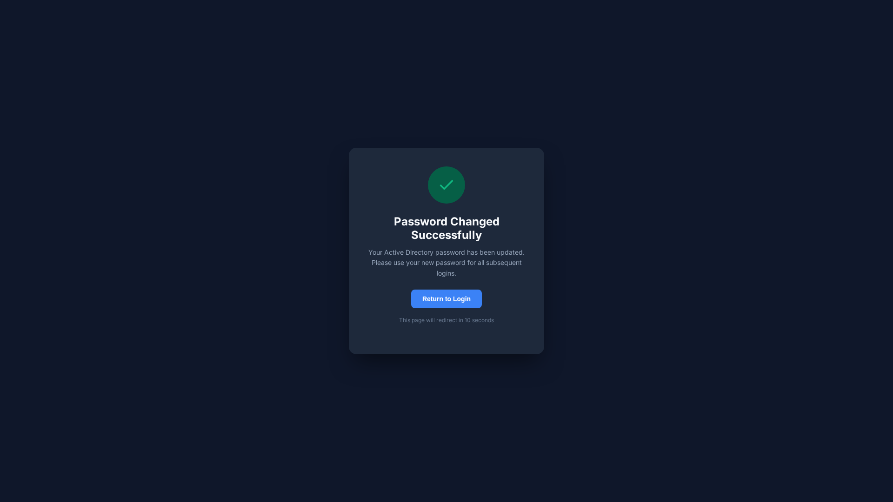

<div align="center">

  

  # 🔐 AD Passreset Portal

  **Self-Service Active Directory Password Change Portal**

  Enable users to securely reset their Active Directory passwords without IT support

  [](https://opensource.org/licenses/MIT)
  [](https://docs.microsoft.com/en-us/dotnet/csharp/)
  [](https://dotnet.microsoft.com/apps/aspnet)
  [](https://www.docker.com/)
  [](https://ldap.com/)

  [Features](#-features) • [Quick Start](#-quick-start) • [Architecture](#-architecture) • [Security](#-security) • [Contributing](#-contributing)

</div>

---

## 📸 Screenshots

<div align="center">

| Login Page | Password Reset | Success Screen |
|------------|----------------|----------------|
|  |  |  |

</div>

> 💡 **Tip:** AD Passreset Portal enforces password complexity policies and provides real-time validation

---

## ✨ Features

| Feature | Description |
|---------|-------------|
| 🔒 **Secure Reset** | LDAP-based password change with TLS encryption |
| 🛡️ **Policy Enforcement** | Validates against AD password policies |
| 🎨 **Modern UI** | Responsive, accessible web interface |
| 📱 **Mobile Friendly** | Works on all devices |
| 🔐 **MFA Support** | Optional multi-factor authentication |
| 📝 **Audit Logging** | Complete audit trail of all password changes |
| 🐳 **Docker Ready** | One-command deployment |
| 🔧 **Configurable** | Customizable password policies |

---

## 🚀 Quick Start

### Prerequisites

- .NET 8.0 SDK or Docker
- Active Directory domain access
- Valid AD credentials for service account

### Installation

#### Option 1: Docker (Recommended)

```bash
# Clone the repository
git clone https://github.com/OneByJorah/ad-passreset-portal.git
cd ad-passreset-portal

# Start with Docker
docker compose up -d
```

#### Option 2: .NET SDK

```bash
# Clone the repository
git clone https://github.com/OneByJorah/ad-passreset-portal.git
cd ad-passreset-portal

# Restore dependencies
dotnet restore

# Build and run
dotnet run --project src/PasswordResetPortal
```

### Access the Portal

Open **https://password.yourdomain.com** in your browser

### Configuration

Edit `appsettings.json`:

```json
{
  "LdapSettings": {
    "Server": "dc.yourdomain.com",
    "Domain": "yourdomain.com",
    "BaseDn": "DC=yourdomain,DC=com",
    "ServiceAccount": "svc-passwordreset",
    "ServicePassword": "your-secure-password"
  },
  "PasswordPolicy": {
    "MinLength": 8,
    "RequireUppercase": true,
    "RequireLowercase": true,
    "RequireDigit": true,
    "RequireSpecialChar": true,
    "HistoryCount": 5
  }
}
```

---

## 🏗️ Architecture

```
┌─────────────────────────────────────────────────────────────┐
│                  AD Passreset Portal                        │
├─────────────────────────────────────────────────────────────┤
│                                                             │
│   ┌──────────┐      ┌──────────┐      ┌──────────────┐    │
│   │  Browser │ ───▶ │  IIS/    │ ───▶ │   ASP.NET    │    │
│   │   SPA    │ ◀─── │  Nginx   │ ◀─── │   Backend    │    │
│   └──────────┘      └──────────┘      └──────┬───────┘    │
│                                               │             │
│                                   ┌───────────┴──────────┐ │
│                                   │                      │ │
│                                   ▼                      ▼ │ │
│                            ┌──────────┐          ┌──────────┐ │
│                            │  LDAP    │          │  Audit   │ │
│                            │  Server  │          │  Log DB  │ │
│                            │  (AD)    │          │          │ │
│                            └──────────┘          └──────────┘ │
│                                                               │
└─────────────────────────────────────────────────────────────┘
```

### Tech Stack

| Component | Technology |
|-----------|------------|
| **Backend** | ASP.NET Core 8.0, C# |
| **Frontend** | Razor Pages, Bootstrap 5 |
| **Authentication** | Windows Authentication / Forms Auth |
| **LDAP** | System.DirectoryServices.Protocols |
| **Database** | SQLite (audit logs) |
| **Deployment** | Docker / IIS |

---

## 📁 Project Structure

```
ad-passreset-portal/
├── src/
│   └── PasswordResetPortal/
│       ├── Controllers/        # API controllers
│       ├── Models/             # Data models
│       ├── Services/           # Business logic
│       │   ├── LdapService.cs  # LDAP operations
│       │   └── PolicyService.cs # Password policy
│       ├── Views/              # Razor views
│       ├── wwwroot/            # Static files
│       └── Program.cs          # Entry point
├── docs/                       # Documentation
│   └── screenshots/            # Portal screenshots
├── tests/                      # Unit tests
├── docker-compose.yml          # Docker deployment
└── appsettings.json            # Configuration
```

---

## 🔒 Security

### Password Requirements

| Rule | Description |
|------|-------------|
| Minimum Length | 8 characters (configurable) |
| Uppercase | At least 1 uppercase letter |
| Lowercase | At least 1 lowercase letter |
| Digit | At least 1 number |
| Special | At least 1 special character |
| History | Cannot reuse last 5 passwords |

### Security Features

- ✅ TLS encryption for all communications
- ✅ LDAP channel binding and signing
- ✅ Account lockout protection
- ✅ Rate limiting on reset attempts
- ✅ Complete audit logging
- ✅ No credentials stored in plaintext

---

## 🛠️ Development

### Local Development

```bash
# Clone the repository
git clone https://github.com/OneByJorah/ad-passreset-portal.git
cd ad-passreset-portal

# Restore and run
dotnet restore
dotnet run --project src/PasswordResetPortal
```

### Running Tests

```bash
dotnet test
```

---

## 🤝 Contributing

Contributions are welcome! Please see [CONTRIBUTING.md](CONTRIBUTING.md) for guidelines.

---

## 📄 License

This project is licensed under the MIT License - see the [LICENSE](LICENSE) file for details.

---

## 🔒 Security

For security concerns, please see [SECURITY.md](SECURITY.md).

---

## 💬 Support

- 📧 Email: support@jorah.one
- 🐛 Issues: [GitHub Issues](https://github.com/OneByJorah/ad-passreset-portal/issues)
- 📖 Docs: [Documentation](docs/)

---

<div align="center">

  **Built with ❤️ by [Jhonattan L. Jimenez](https://github.com/OneByJorah)**

  [⬆ Back to Top](#-ad-passreset-portal)

</div>
