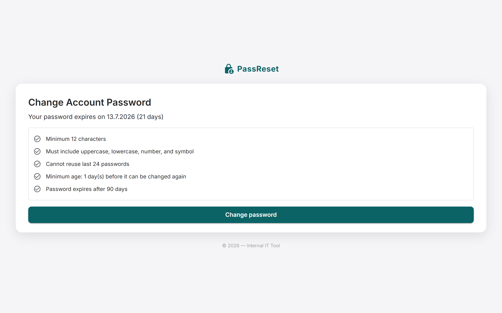

<div align="center">
  
  
  
  
</div>

<br>

<div align="center">
  <h1>ad-passreset-portal</h1>
  <p><strong>Self-Service Active Directory Password Reset Portal</strong></p>
  <p>Browser-based self-service password reset for Active Directory and Windows.</p>
  <p>
    <a href="#features">Features</a> •
    <a href="#quick-start">Quick Start</a> •
    <a href="#configuration">Configuration</a> •
    <a href="#contributing">Contributing</a>
  </p>
</div>

---

## Screenshot


*Self-service Active Directory password reset portal.*

## Features

- **Self-Service Reset** — Employees change their own password without helpdesk.
- **Policy Enforcement** — Enforces AD password policies (complexity, history, age).
- **LDAPS Support** — Secure LDAP connections to Active Directory.
- **Admin Console** — Manage users, OUs, and portal settings.
- **Audit Logging** — Track all password reset attempts and outcomes.
- **Email Notifications** — Alert admins of failed attempts.
- **Docker Support** — Easy deployment with Docker.
- **Responsive Design** — Works on desktop and mobile devices.

## Quick Start

### Docker (Recommended)

```bash
git clone https://github.com/OneByJorah/ad-passreset-portal.git
cd ad-passreset-portal

cp .env.example .env  # Configure AD settings
docker compose up -d
```

Open **http://localhost:5000** in your browser.

### Manual Installation

```bash
# Prerequisites: .NET 6+ Runtime

dotnet restore
dotnet build
dotnet run
```

## Environment Variables

| Variable | Default | Description |
|----------|---------|-------------|
| `AD_LDAP_SERVER` | — | Active Directory server hostname |
| `AD_LDAP_PORT` | `636` | LDAP port (636 for LDAPS) |
| `AD_BASE_DN` | — | Base DN for user searches |
| `AD_SERVICE_ACCOUNT` | — | Service account username |
| `AD_SERVICE_PASSWORD` | — | Service account password |
| `ADMIN_EMAIL` | — | Admin email for notifications |
| `SMTP_HOST` | — | SMTP server for email alerts |
| `PORT` | `5000` | Application port |

## Configuration

### Active Directory Settings

1. Create a service account in AD with "Reset Password" permissions
2. Enable LDAPS on your domain controller
3. Add the service account credentials to `.env`

### Password Policies

The portal enforces these AD policies:
- Minimum length (configurable)
- Complexity requirements (uppercase, lowercase, numbers, symbols)
- Password history (prevents reuse)
- Maximum age (if configured in AD)

## Architecture

```
Browser ──HTTPS──▶ ASP.NET Core ──LDAPS──▶ Active Directory
                        │
                        ├──▶ Audit Logger
                        ├──▶ Email Notifier
                        └──▶ Admin Console
```

## Project Structure

```
ad-passreset-portal/
├── Controllers/
│   ├── HomeController.cs       # Main pages
│   ├── PasswordController.cs   # Password reset logic
│   └── AdminController.cs      # Admin console
├── Services/
│   ├── ActiveDirectoryService.cs  # AD integration
│   ├── AuditService.cs            # Logging
│   └── EmailService.cs            # Notifications
├── Views/                       # Razor views
├── wwwroot/                     # Static assets
├── docker-compose.yml           # Docker deployment
├── appsettings.json             # Configuration
└── README.md
```

## Admin Console

Access the admin console at `/admin`:

| Feature | Description |
|---------|-------------|
| User Management | View and manage portal users |
| Audit Logs | Review all password reset attempts |
| Policy Settings | Configure password requirements |
| Email Settings | Configure notification recipients |

## Contributing

Contributions are welcome. Please see [CONTRIBUTING.md](CONTRIBUTING.md) for guidelines and [CODE_OF_CONDUCT.md](CODE_OF_CONDUCT.md) for community standards.

## Security

For security concerns, see [SECURITY.md](SECURITY.md). Please report vulnerabilities to **info@jorahone.com** — do not use public issues.

## License

MIT © Jhonattan L. Jimenez

---

<div align="center">
  <p>Self-service Active Directory password reset.</p>
  <p><a href="https://github.com/OneByJorah">@OneByJorah</a></p>
</div>
